<!-- FILE: CONTRIBUTING.md -->
# Contributing to hum

Welcome! **hum** is a global .NET CLI tool that bootstraps new services end-to-end—GitHub repo, CI/CD via GitHub Actions, and Ansible inventory—so you can go from “idea” to “running in prod” in under a minute.

## Prerequisites

- .NET SDK ≥ 8.0  
- GitHub CLI (`gh`)  
- Ansible 2.15+  
- Recommended VS Code extensions:  
  - **ms-dotnettools.csharp**  
  - **DavidAnson.vscode-markdownlint**  
  - **redhat.vscode-yaml**  

## Setting up Your Dev Environment

```bash
git clone https://github.com/akwaduk/hum.git
cd hum
make bootstrap       # or: dotnet restore
make test            # runs unit tests
make e2e             # optional Ansible-driven smoke tests
```

## Branch & PR Workflow

- **Fork** the repo (unless you have direct write access), then **branch** from `main`.  
- Use **Conventional Commits** (`feat:`, `fix:`, `docs:`, etc.).  
- Rebase your branch onto the latest `main` before opening a PR.  
- Keep each PR focused on one logical change.

## Running the CLI from Source

```bash
dotnet run --project src/hum -- doctor
```

## Code Style

- Target C# 10, .NET 8 conventions.  
- An `.editorconfig` is committed.  
- Run `make format` (alias for `dotnet format`) before each commit.

## Unit Tests & Coverage

```bash
dotnet test /p:CollectCoverage=true
```
- Coverage threshold: **90%**.

## End-to-End Smoke Tests

- Requires Ansible/AWX credentials.  
- Skip by setting `HUM_E2E_SKIP=1`.

## Conventional Commit Message Guide

| Type      | Description               |
|-----------|---------------------------|
| feat      | ✨ New feature             |
| fix       | 🐛 Bug fix                |
| docs      | 📝 Documentation only     |
| ci        | ⚙️ CI configuration       |
| refactor  | ♻️ Code restructuring     |
| chore     | 🔧 Maintenance tasks      |

## Signing the CLA

Please sign the Contributor License Agreement in [CLA.md](CLA.md) before your first PR.

## Code of Conduct

Be respectful and inclusive. See [CODE_OF_CONDUCT.md](docs/CODE_OF_CONDUCT.md).

## License

This project is licensed under MIT. See [LICENSE](LICENSE).

---

<!-- FILE: .github/CODEOWNERS -->
# Grant code-review & merge rights
* @erik-johnson @core-maintainers

---

<!-- FILE: .github/PULL_REQUEST_TEMPLATE.md -->
# PR Title
`feat(scope): short, imperative summary`

## Description

_What does this change?_  

## Checklist

- [ ] I ran `make format` and `make test`.  
- [ ] My commit messages follow Conventional Commits.  
- [ ] I updated relevant documentation (`docs/` or inline XML).  
- [ ] *(If adding a command)* I added examples to `hum --help`.  
- [ ] *(If touching deployment logic)* I ran `make e2e` or explained why not.

---

<!-- FILE: .github/ISSUE_TEMPLATE/bug_report.yml -->
name: 🐛 Bug report
about: Create a report to help us improve
title: '[BUG] '
labels: bug
body:
  - type: markdown
    attributes:
      value: |
        Thanks for taking the time to report an issue! Please fill out the details below.
  - type: input
    id: hum_version
    attributes:
      label: hum version
      placeholder: e.g. 1.2.3
  - type: input
    id: os
    attributes:
      label: Operating system
  - type: input
    id: dotnet_info
    attributes:
      label: Output of `dotnet --info`
  - type: textarea
    id: steps_to_reproduce
    attributes:
      label: Steps to reproduce
  - type: textarea
    id: expected
    attributes:
      label: Expected behavior
  - type: textarea
    id: actual
    attributes:
      label: Actual behavior
  - type: textarea
    id: logs
    attributes:
      label: Logs or error output

---

<!-- FILE: .github/ISSUE_TEMPLATE/feature_request.yml -->
name: ✨ Feature request
about: Suggest an idea for this project
title: '[FEATURE] '
labels: enhancement
body:
  - type: markdown
    attributes:
      value: |
        Thanks for suggesting a feature! Please describe it in detail.
  - type: textarea
    id: problem
    attributes:
      label: Problem you are trying to solve
  - type: textarea
    id: proposed_solution
    attributes:
      label: Proposed solution / UX
  - type: textarea
    id: alternatives
    attributes:
      label: Alternatives considered
  - type: textarea
    id: context
    attributes:
      label: Additional context

---

<!-- FILE: .github/SECURITY.md -->
# Security Policy

## Supported Versions

We actively support the latest major release and the one previous major release.

## Reporting a Vulnerability

Please email security@yourdomain.com with any security concerns.

## Public Disclosure Timeline

After a fix has been merged, issues will be publicly disclosed after 90 days.

---

<!-- FILE: docs/DEVELOPMENT.md -->
# Development & Architecture

## Architecture Overview

```mermaid
flowchart LR
  dev["Developer CLI<br/>hum"] --> gh["GitHub<br/>New Repo"]
  gh --> gha["GitHub Actions<br/>(template workflow)"]
  hum --> inv["Ansible Inventory<br/>Pull Request"]
  gha --> awx["Ansible AWX / CLI"]
  awx --> srv["App Server<br/>NGINX · systemd · SQLite"]
  srv --> cpsvc["Backup Service"]
```



> *Tip:* commit this diagram to `docs/architecture.md` for richer docs.

## Glossary

- **Scaffold**: The code and files generated to start a new project.  
- **Inventory PR**: A pull request to your infrastructure repo updating Ansible inventory.  
- **Bootstrap**: The process of generating repo, CI and inventory for a new service.  
- **E2E Tests**: End-to-end smoke tests that validate deploy pipelines.
